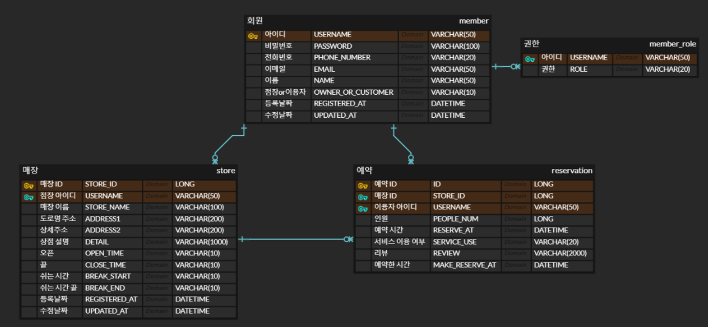
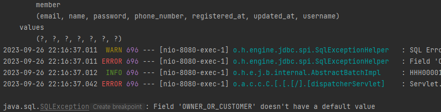

# zb-table-reservation


## 사용 라이브러리


#### Swagger : API 문서 자동으로 만들어주는 라이브러리


#### 매장을 방문할 때 미리 방문 예약을 할 수 있는 기능을 구현한다




- **매장**
  - 오픈/끝/쉬는시간/쉬는시간끝 부분에서 타입을 DATETIME에서 VARCHAR로 바꿨다
    - 막상 만드려고 하니, 문자열로 받는게 훨씬 편하다고 판단했다
  - 쉬는 날
  - CLOSE_TIME을 LAST_RESERVE_TIME 으로 변경
  - 매장이 예약 가능한 시간
    - break time이 없을 경우 : OPEN_TIME ~ LAST_RESERVE_TIME
    - break time이 있는 경우 : OPEN_TIME ~ BREAK_START (1시간 전) + BREAK_END ~ LAST_RESERVE_TIME
- **예약**
  - RESERVE_AT을 RESERVE_DATE와 RESERVE_TIME으로 나누었다
    - RESERVE_DATE는 날짜만 받는다
    - RESERVE_TIME은 문자열로 시간을 받는다 (24시 형태로 "23:10" 이런 식으로)


## 공통


#### 회원 가입

- 회원 가입은 모든 유저들이 사용할 수 있다
- 모든 Input 부분은 같으나, ROLE 부분에서 매장 점주와 이용자 역할을 고를 수 있다
  - "0" : 매장 점장
  - "1" : 매장 이용자


```
POST http://localhost:8080/member/register

Content-Type : application/json

{
  "username" : "joonlee",
  "password" : "12345",
  "phoneNumber" : "010-1234-1234",
  "email" : "jj@naver.com",
  "name" : "je joon",
  "role" : "1"
}
```


#### 로그인

- 특정 기능을 사용하기 위해서는 로그인을 하고 인증을 해야 한다
  - 인증 후 생성된 토큰을 이용하여 구현된 기능을 사용한다

```
POST http://localhost:8080/member/login

Content-Type : application/json

{
  "username" : "joonOwner",
  "password" : "12345"
}
```


#### 키워드로 매장 찾기

- 키워드를 입력하여 매장을 찾는다
- 키워드는 매장 이름을 토대로 검색 결과를 반환한다

```
GET http://localhost:8080/store/search?keyword={Keyword}
```


#### 매장 상세 정보 찾기

- 주어진 매장 번호를 입력하여 매장 상세 정보를 찾는다

```
GET http://localhost:8080/store?storeId={storeId}
```


## 매장 점장


#### 상점 등록하기

- 상점을 등록하기 위해서는 유저가 로그인이 되어 있어야 하며, 유저의 ROLE 은 STORE_OWNER이어야 한다
- 쉬는 시간인 경우 없음을 넣으면 DB에 NULL로 저장이 된다

```
POST http://localhost:8080/store/register

Content-Type : application/json
Authorization : Bearer {토큰}

{
  "storeName" :"음식점",
  "address1" : "음식점로",
  "address2" : "231",
  "detail" : "맛있는 음식점",
  "openTime" : "09:00",
  "lastReserveTime": "22:00",
  "breakStart" : "없음",
  "breakFinish" : "없음"
}
```


#### 등록한 상점들 보기

- 로그인한 상점 사장이 등록한 모든 상점들을 볼 수 있다

```
GET http://localhost:8080/store/all

Authorization : Bearer {토큰}
```


#### 상점 정보 수정하기

- 상점 등록하기와 매우 흡사하다
- 여기서는 storeNum을 받아서 해당 상점의 주인이 로그인한 유저와 동일 인물인지 확인을 한 후 수정을 진행한다

```
PUT http://localhost:8080/store/update

Content-Type : application/json
Authorization : Bearer {토큰}

{
  "storeNum": "10",
  "storeName" :"음식점",
  "address1" : "음식점로",
  "address2" : "3334",
  "detail" : "맛있는 음식점",
  "openTime" : "09:00",
  "lastReserveTime": "22:00",
  "breakStart" : "12:00",
  "breakFinish" : "13:00"
}
```


#### 상점 삭제하기

- 등록한 상점을 삭제한다
- 삭제하려는 상점이, 로그인한 유저가 등록한 상점인지 확인 후 삭제를 진행 한다

```
DELETE http://localhost:8080/store/delete?storeNum={storeNum}

Authorization : Bearer {토큰}
```


#### 예약 확인하기

- 상점에 대한 모든 예약을 확인해준다
- 그러기 위해 상점을 등록한 사람이, 현재 로그인한 사람인지 확인을 한다
- 만약 예약이 시간이 지났을 경우, 자동으로 취소를 시킨다

```
GET http://localhost:8080/store/reservations?storeId={storeNum}

Authorization : Bearer {토큰}
```


#### 예약 취소하기

- 취소지만, 예약 이용 상태를 바꾸는 기능이다
- 예약 내역에 대한 상점과, 입력한 상점이 같은지 확인한다
- 예약 내역에 저장된 username과, request로 보낸 username이 같은지 모두 확인 후, 예약을 취소 시킨

```
POST http://localhost:8080/store/cancel-reservation

Content-Type : application/json
Authorization : Bearer {토큰}

{
  "reservationId" : "18",
  "storeId" : "10",
  "username" : "joon"
}
```


## 매장 이용자


#### 예약하기

- 간단하게 상점 번호와, 상점을 이용한 사람들의 수, 그리고 날짜와 시간을 요청한다
- 날짜 같은 경우
  - 과거면 안 됨
  - 현재로부터 2시간 이후 부터 예약이 가능
  - 상점에 쉬는 시간이 있으면, 쉬는 시간 사이에 예약 불가능

```
POST http://localhost:8080/customer/reserve

Content-Type : application/json
Authorization : Bearer {토큰}

{
  "storeId" : "10",
  "peopleNum" :"4",
  "reserveDate" : "2023-10-09 15:00"
}
```


#### 예약 조회하기

- 로그인한 상점 이용자의 모든 예약 내역을 보여준다

```
GET http://localhost:8080/customer/my-reservations

Authorization : Bearer {토큰}
```


#### 예약 수정하기

- 예약을 수정하기 위해서는 예약 번호와, 예약 내역에 저장되어 있는 상점이 일치한지 확인을 한다
- 또한 예약을 한 사람과, 로그인 한 사람의 정보가 같은지 확인을 한다
- 날짜는 위에 예약 등록과 동일하다

```
PUT http://localhost:8080/customer/reserve/update

Content-Type : application/json
Authorization : Bearer {토큰}

{
  "reservationNum" : "9",
  "storeId" : "10",
  "peopleNum" :"4",
  "reserveDate" : "2023-10-10 13:00"
}
```


#### 예약 삭제하기

- 또한 예약을 한 사람과, 로그인 한 사람의 정보가 같은지 확인을 한다
- 확인 후, 예약을 삭제한다

```
DELETE http://localhost:8080/customer/reserve/cancel?reserveNum={ReserveId}

Authorization : Bearer {토큰}
```


#### 리뷰 작성하기

- 예약 내역을 확인한다
- 예약 내역에서, 예약을 사용 (USED) 상태일 때만 리뷰를 쓸 수 있도록 한다
- 만약 이미 리뷰가 써져 있을 경우, 수정을 하도록 메세지를 보내준

```
POST http://localhost:8080/customer/review/write

Content-Type : application/json
Authorization : Bearer {토큰}

{
  "reservationId": "8",
  "review": "너무 맛있어요"
}
```


#### 리뷰 수정하기

- 예약이 존재하는지, 예약한 사람과 로그인한 사람의 정보가 일치한지 확인을 하고 수정을 한다
- 리뷰에 아무것도 없으면, 리뷰를 쓰도록 메세지를 보낸다

```
PUT http://localhost:8080/customer/reserve/update

Content-Type : application/json
Authorization : Bearer {토큰}

{
  "reservationId": "8",
  "review": "너무 맛있어요!!!!!!"
}
```


#### 리뷰 지우기

- 예약 내역에 저장된 유저와 로그인한 유저가 일치한지 확인한다
- 리뷰를 NULL 상태로 저장을 한다

```
DELETE http://localhost:8080/customer/review/delete?reserveNum={reserveId}

Authorization : Bearer {토큰}
```


#### 작성한 리뷰들 보기

- 로그인한 STORE_USER 의 모든 예약 내역을 보여준다
- 여기서 예약 내역 중, 예약 시간이 지났을 경우, 자동으로 예약을 취소 시킨다

```
GET http://localhost:8080/customer/review/read

Authorization : Bearer {토큰}
```


## 키오스크


#### 키오스크 예약 확정하기

- 예약 번호와, 예약한 사람의 유저이름을 입력한다
- 예약 번호와 예약한 사람의 유저 이름을 확인을 한 후, 예약 시간 10분 전에 확인을 하면, 매장을 사용할 수 있도록 처리를 해준다

```
POST http://localhost:8080/kiosk/check
Content-Type : application/json

{
  "reservationNum": "14",
  "username": "joon"
}
```


#### 


## Issue




#### 권한 부여 하기

- 원래는 그냥 문자열로 권한을 부여하려고 했다
- 리스트로 만들어서 권한을 부여하는 것이 좋을 것 같다고 판단
  - 하지만 위와 같이 OWNER_OR_CUSTOMER 필드를 안 가지고 온다는 것을 볼 수 있음
- **9.27** : MEMBER_ROLE 테이블을 만들어서, 그 테이블에 권한을 부여하기! 

```java
@ElementCollection(fetch = FetchType.EAGER)
@Column(name = "ROLE", length = 20)
private List<String> role;
```

- ElementCollection 을 사용하면, 새로운 테이블을 만들어준다 (여기서는 권한 테이블)
  - 그리고 원래 member 테이블에서 권한 칼럼은 삭제를 해주면 된다


#### servlet.service() for servlet [dispatcherservlet] in context with path [] threw exception [request processing failed; nested exception is java.lang.nullpointerexception] with root cause

- 두 가지 원인이 있는 것 같다 (개인적으로 찾은 것 중)
  - 의존성 주입 (**private final**) 이 제대로 안 적혀있을 때
  - DB에 데이터를 넘길 때에, 제대로 쿼리 값이 주입이 안 될 때
- 또는 Header에 특정 정보를 안 넘겼을 때 발생했다
  - Authorization 정보를 넣어야 하는데, 안 넣었다 ㅜ.ㅜ (Bearer + token) 을 넣어야 한다


